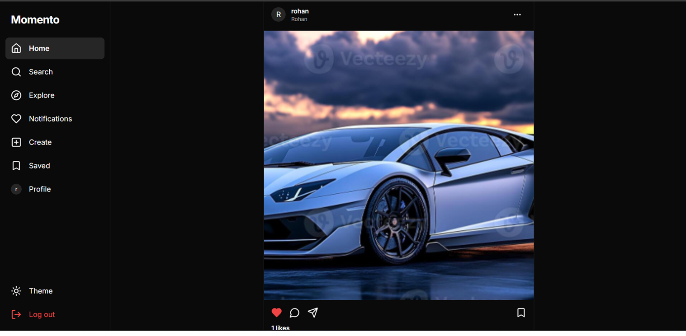
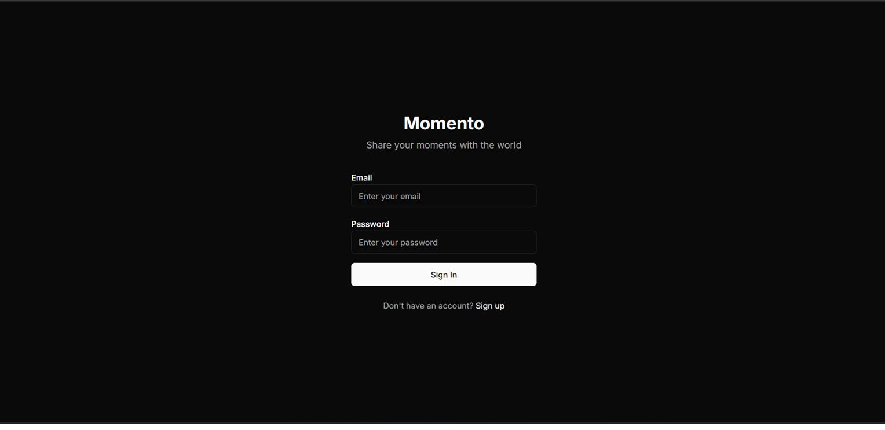
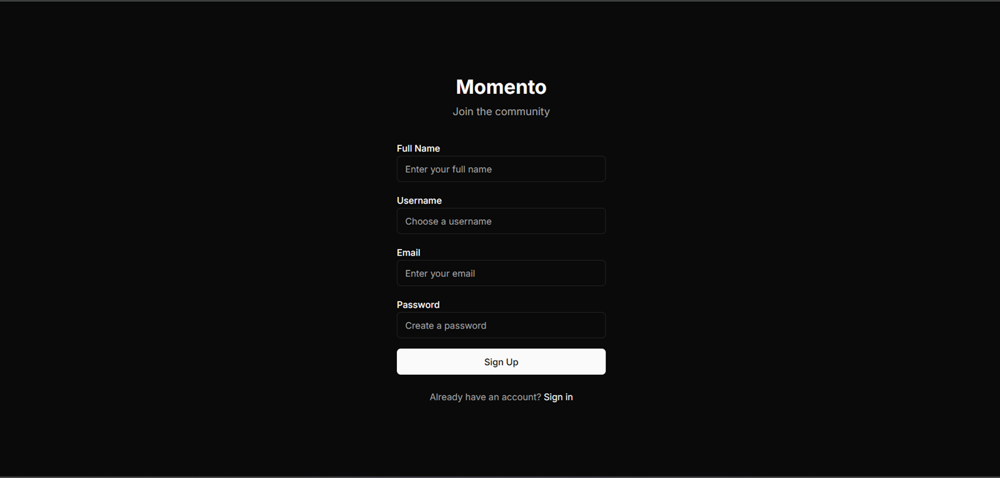
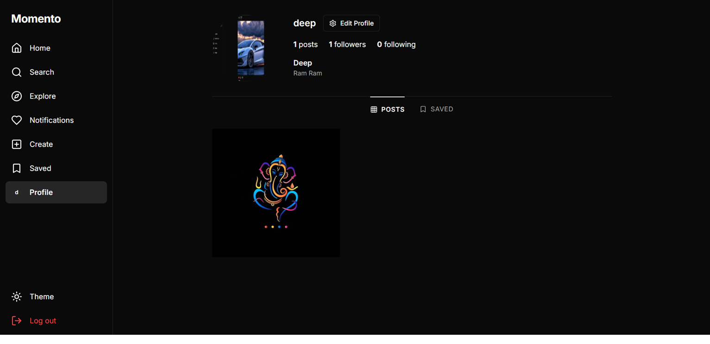
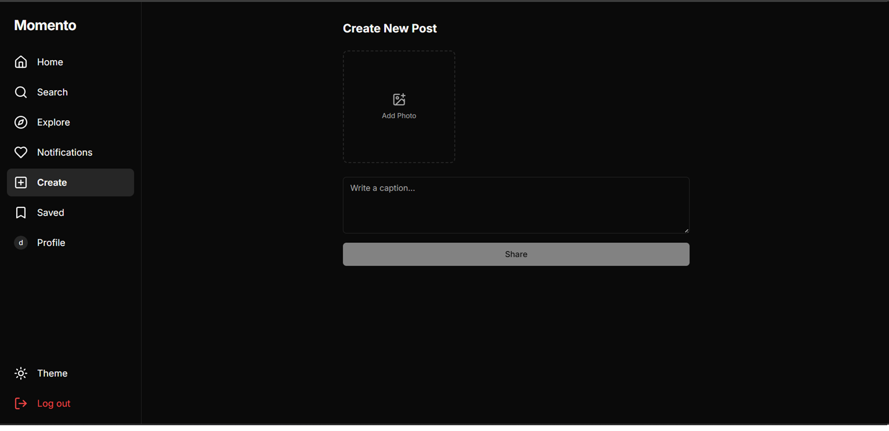
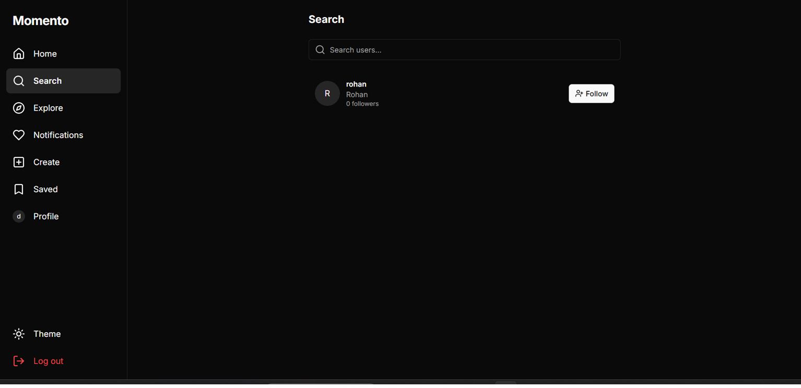

# 📸 Momento

A modern social media platform inspired by Instagram, built with Next.js 13, TypeScript, MongoDB, NextAuth, Tailwind CSS, and Supabase.

## ✨ Features

- 🔐 Secure Authentication (NextAuth)
- 👤 User Registration & Login
- 📝 Create, Edit & Delete Posts
- ❤️ Like Posts
- 💬 Comment System
- 👥 Follow / Unfollow Users
- 🔔 Notifications
- 🔍 User Search
- 📁 Save Posts
- 📱 Responsive Design
- 🌙 Dark Mode
- ☁️ Image Upload Support
- ⚡ Fast & Modern UI

---

## 🛠 Tech Stack

### Frontend
- Next.js 13
- React
- TypeScript
- Tailwind CSS
- Framer Motion
- Shadcn UI

### Backend
- Next.js API Routes
- MongoDB
- Mongoose
- NextAuth

### Database
- MongoDB Atlas
- Mongoose

### Storage
- Supabase Storage

---

## 📂 Project Structure

```
app/
components/
hooks/
lib/
providers/
public/
types/
```

---

## 🚀 Getting Started

### Clone the repository

```bash
git clone https://github.com/YOUR_USERNAME/momento.git
```

### Go inside the project

```bash
cd momento
```

### Install dependencies

```bash
npm install
```

### Create a .env file

```env
MONGODB_URI=your_mongodb_uri

NEXTAUTH_URL=http://localhost:3000
NEXTAUTH_SECRET=your_secret

NEXT_PUBLIC_SUPABASE_URL=your_supabase_url
NEXT_PUBLIC_SUPABASE_ANON_KEY=your_supabase_key
```

### Run the project

```bash
npm run dev
```

Open:

```
http://localhost:3000
```

---

## 📸 Screenshots

### 🏠 Home Feed



---

### 🔐 Login



---

### 📝 Register



---

### 👤 Profile



---

### ➕ Create Post



---

### 🔍 Search Users



---

## 🌟 Future Improvements

- Stories
- Reels
- Real-time Chat
- Push Notifications
- PWA Support
- Mobile App

---

## 👨‍💻 Author

Garv Arora

GitHub:
https://github.com/Garv31